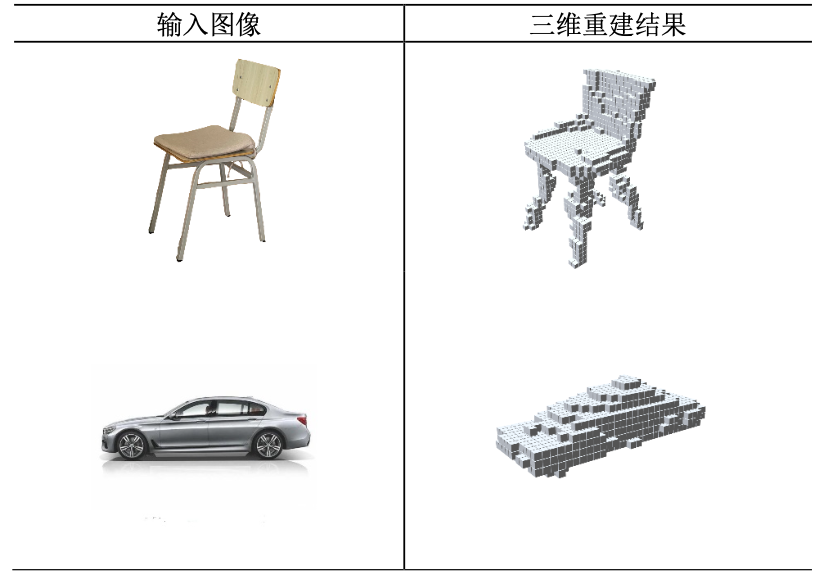
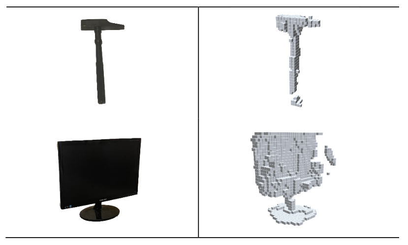
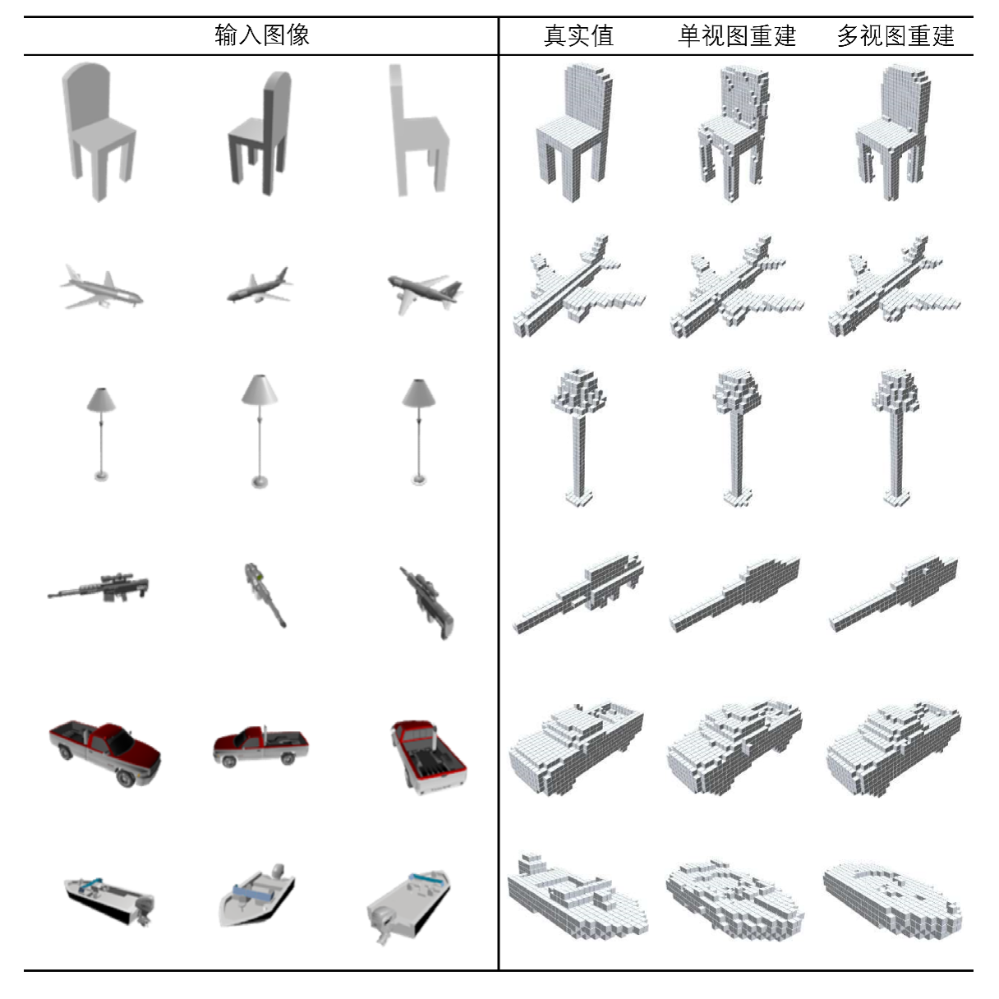
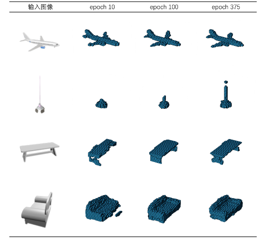

# Pix2Vox Keras Deployment

## Project Description

This is a project that deploy the Pix2Vox network using keras. This method is based on single or multiple RGB input images and adopts end-to-end encoder-decoder and U-net refiner structure to realize 3D object reconstruction function. The model that trained by keras can deploy on web using tfjs that the Pix2Vox cxan run offline on edge devices: [WebTFJSDeployment](WebTFJSDeployment/readme.md)

|  |  |
| ------------------------------- | ------------------------------- |







I‘m sorry that the code currrently cannot run properly using the command of 

```
python runner.py --epoch [] --weight [] --out []
```

But the code in core folder is done very good.... just for reference.. I'm not sure ...

 

