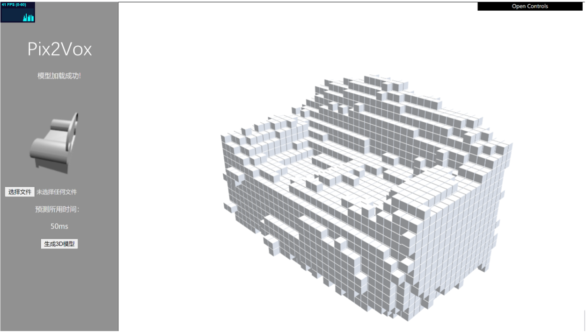

# Pix2Vox Deployment on Web using TFJS



please  first use

```
npm install
```

and web server (xampp(Apache) )to launch the application

May have some bug in the node.js module...

If you wanna to edit the index.js, please edit index_unpack.js and use browserify to pack it to index.js